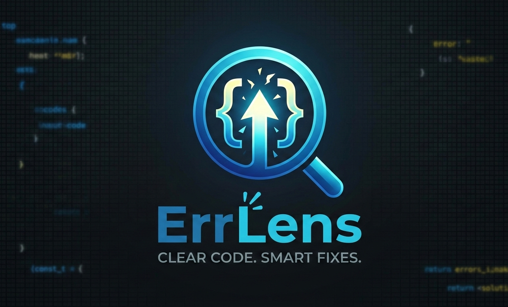
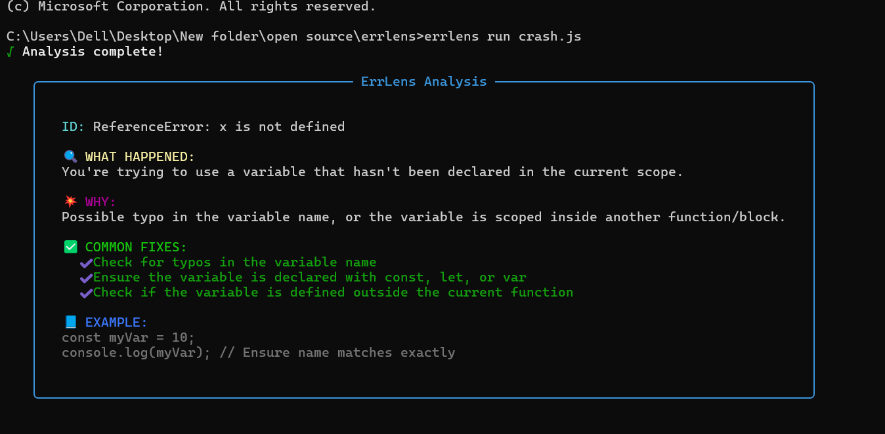

# ErrLens 🔍  
> **Translate cryptic JavaScript errors into human-readable solutions instantly.**

<p align="center">
  
</p>
</br>
</br>

<p align="center">
  <!-- GitHub Badges -->
  
  
  
  
  
  
  <!-- npm Badges -->
  <br>
  
  
  
  
</p>
**ErrLens** is a professional-grade CLI utility designed to eliminate developer frustration. It intercepts Node.js crashes, analyzes stack traces, and delivers plain-English explanations with actionable fixes—directly in your terminal.

---
</br>
</br>
</br>
<p align="center">
  
</p>
</br>
</br>

## 🌟 Key Features

- 🚀 **Instant Diagnostics** – No more context-switching to Google or StackOverflow.  
- 🔄 **Live Monitoring** – Catch errors in real-time using the `errlens run` command.  
- 🧠 **Fuzzy Logic Engine** – Matches messy stack traces and typos using `Fuse.js`.  
- 🎨 **Beautiful UI** – High-visibility terminal output powered by `boxen` and `chalk`.  
- 🤖 **CI/CD Ready** – Export raw data via `--json` for automated error reporting.  

---

## 📦 Installation

Install globally via npm to use the `errlens` command anywhere in your terminal:

```bash
npm install -g errlens
```

---

## 🛠 Usage

### 1️⃣ Automatic Monitoring (The "Pro" Way)

Run your script through ErrLens. If it crashes, ErrLens intercepts the error and explains the fix before the process exits.

```bash
errlens run your-app.js
```

---

### 2️⃣ Manual Analysis

Found a weird error in your logs? Just paste the message:

```bash
errlens "TypeError: Cannot read properties of undefined"
```

---

### 3️⃣ Pipeline Integration

Get machine-readable results for your own tooling or automated reports:

```bash
errlens "is not a function" --json
```

---

## 🧠 System Architecture

ErrLens operates on a three-stage intelligent pipeline to turn confusion into clarity:

| Phase          | Component       | Description |
|---------------|----------------|-------------|
| Interception  | `auto.js`      | Hooks into the `uncaughtException` event via a preload script. |
| Matching      | `matcher.js`   | Uses fuzzy search against `database.json` to find the root cause. |
| Formatting    | `formatter.js` | Wraps the diagnosis in a clean, color-coded terminal interface. |

---

## 📁 Project Structure

```
errlens/
├── bin/index.js       # CLI Entry point & Command routing
├── lib/
│   ├── matcher.js     # Fuzzy search & Logic engine
│   ├── formatter.js   # UI & Terminal styling
│   ├── auto.js        # Automation & Error interception
│   └── database.json  # The "Knowledge Base" (Dictionary)
├── package.json       # Dependencies & Metadata
└── README.md          # Documentation
```

---

## 🤝 Contributing

We are building the world's most comprehensive dictionary of JavaScript errors, and we need your help!

1. Fork the repository.  
2. Add a new error entry to `lib/database.json`.  
3. Submit a Pull Request.  

💡 **Tip:** Every error you add helps another developer save valuable time. Join the mission!

---

## 📝 License

Distributed under the MIT License. See `LICENSE` for more information.

---

<p align="center">
  Built with ❤️ by <b>BeyteFlow</b><br>
  <i>Making the terminal a friendlier place, one error at a time.</i>
</p>
